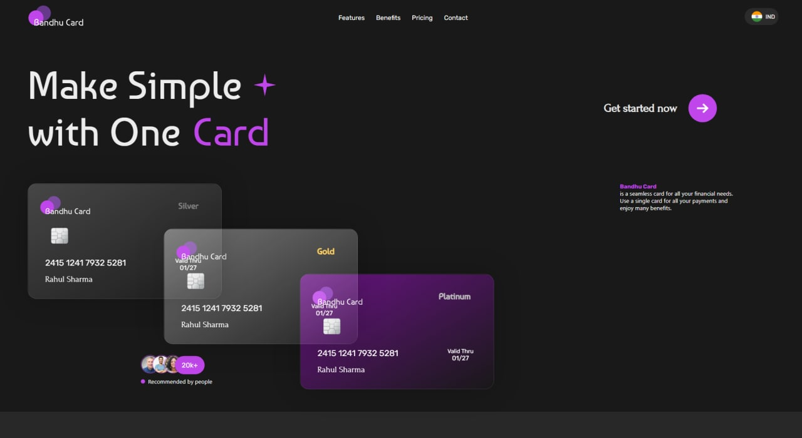

## Bandhucard
We aim to build a smart, simple, and transparent financial platform to redesign the financial experience for the Youngsters. 




##  🚀 View Live Demo

<pre><center><a href="https://subtle-speculoos-e4cab8.netlify.app/"><b>Bandhu_Card.netlify.app</b></a></center></pre>


## 🛠️ Installation Steps
Star and Fork the Repo 🌟 and this will keep us motivated.

1. Clone the repository


### First time setup

```sh

https://github.com/RahulSharma4329/Bandhu-Card-Landing-Page.git

```

## To run on localhost

```sh
npm start
```


## To make a production build 
```sh
npm run build
``` 

## ⭐ Contributing
[](http://makeapullrequest.com)
[](https://github.com/ellerbrock/open-source-badges/)

- Take a look at the Existing [Issues](https://github.com/RahulSharma4329/Bandhu-Card-Landing-Page) or create your own Issues!
- Wait for the Issue to be assigned to you after which you can start working on it.
- Fork the Repo and create a Branch for any Issue that you are working upon.
- Create a Pull Request which will be promptly reviewed and suggestions would be added if necessary.


## Thanks to all contributors ❤
<a href="https://github.com/RahulSharma4329/Bandhu-Card-Landing-Page/graphs/contributors">
  
</a>

